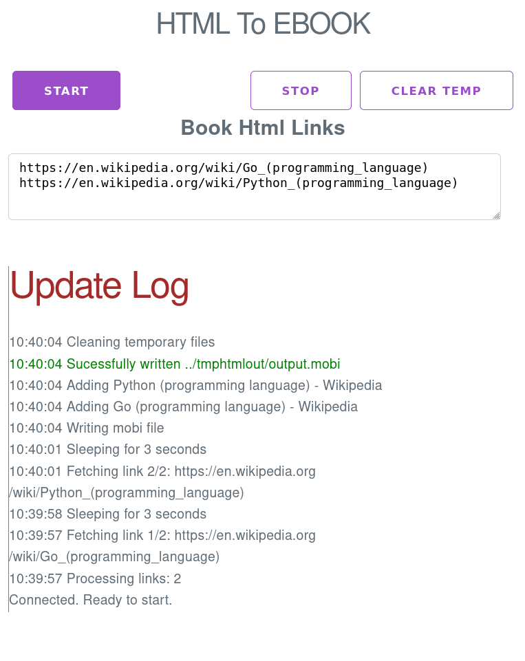

# htmltoebook
Converts html webpages to a readable ebook. Fetches the list of html urls given and creates a ebook that can be used in ebook reader or phones.

* Fetches and cleans up the webpages as readable paragraphs using [readability](github.com/go-shiori/go-readability) package.
* Currently supported output format is mobi
* Two user interfaces supported, cli and webui. Launches webui by default.

## TODO
* Support epub format
* Add webview to link with platform webkit, without need to open link in external browser
* UI for configuration
* UI to generate range of URLs that could expand in a given numeric range
* Generate release binaries using Actions.